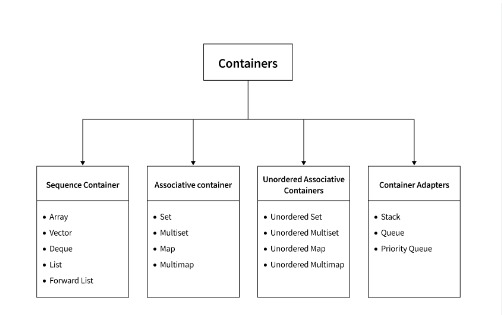

# Standard Template Library (STL)
- STL stands for Standard Template Library, and it is a powerful set of C++ template classes and functions that provide reusable, generic programming tools.
- The STL is part of the C++ Standard Library and is included in all modern C++ compilers.

## Containers in STL
- In C++, the Standard Template Library (STL) provides a set of container classes that allow you to store and manipulate data in various ways.
- Containers are the objects which contain different objects.
- Containers may be containe objects or attributes.

## Types Of Containers

## Topics Cover
- ### [Arrays](Arrays/Docs.md)
- ### [Vectors](Vectors/Docs.md)
- ### [DEQUE](DEQUE/Docs.md)
- ### [Stack](Stack/Docs.md)
- ### [List](List/Docs.md)

